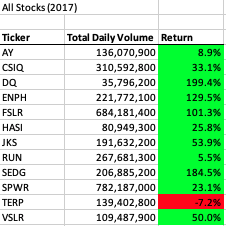
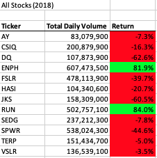
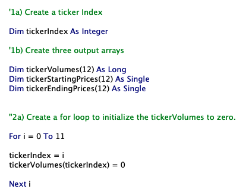
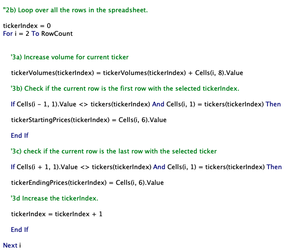
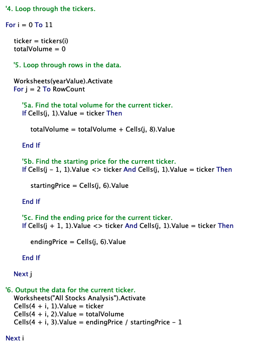
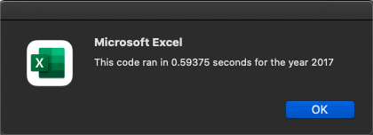
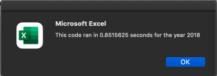
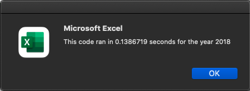

# Stock Analysis Refactored

## Overview of the Project

In this project we refactored existing VBA code to loop through thousands of rows of a stock results dataset to calculate the total daily volume and the return for each stock based on the year that was provided. Although our original code worked well for a few stocks, it would run slowly if the analysis was done for thousands of stocks. By refactoring our code, we can speed up the analysis which will allow it to perform much better. We will then determine if this refactored code ran faster than the original code we ran for All Stocks Analysis.

## Results

### Comparing Stock Performance Between 2017 and 2018

The stocks in 2017 performed very well, with only one stock, TERP, having a negative return. There were four stocks, DQ, ENPH, FSLR, and SEDG, that more than doubled their return.

The results for 2018 told a much different story, almost every stock had a negative return. ENPH and RUN were the only stocks to have a positive return with 81.9% and 84% respectively.

### Comparing Execution Times of Refactored Code

[Link to Excel/VBA workbook with relavant data and code](https://github.com/SeanDraper/stock-analysis/blob/main/VBA_Challenge.xlsm)

By refactoring our code, we were able to dramatically increase the speed that the code was executed. The major difference between our original and refactored code was the use of the tickerIndex variable to keep track of which stock ticker was being referenced as the code looped through the data.

You can see in the above snippet that tickerIndex is declared as an integer and there is a dedicated loop to set the inital volumes for each index to 0.

We then created a new loop to increase the volume for the current ticker and then check to see if the current row is the first or last row for the current ticker. If it was the last row, we set the ending price and then increased the tickerIndex by one, moving to the next ticker.

In the original loop shown above, we used a nested loop instead of utilizing tickerIndex. As you'll see below, this caused the code to run much slower.

You can see that the refactored code ran much faster for 2017 with a speed of about .1 seconds compared to .59 seconds from the original code.

The same holds true for 2018 with a speed of about .14 seconds for the refactored code and .85 seconds for the original.

## Summary

### What are the advantages or disadvantages of refactoring code?

Refactoring code has several advantages and disadvantages. By refactoring, you can speed up how fast the code is executed in comparison to the original. Even several miliseconds of increased speed could have great value if the code is looping through a very large dataset. Refactored code can also often times be much cleaner and easier to read. This would allow for yourself or other programmers in the future to edit and build upon the code without having to clean up and refactor first. 

On the down side, refactoring could introduce bugs that were not originally present in the code. This could cause extensive downtime to work through and fix bugs to make the code operable again. Refactoring can also be time consuming, and a company may have to spend extra resources to devote to the process of refactoring. Although the benifits of this resource expenditure may prove to outweigh the negative effects depending on the situtation.

### How do these pros and cons apply to refactoring the original VBA script?

By refactoring our orginal All Stock Analysis code we were able to substantially increase the speed that the code was executed. If we were to apply this code to a much larger stock dataset, the code would still run very fast where as the original code would take several seconds to complete.

The refactoring process was time consuming but overall worth it in the end as evident by our speed increase. As I worked though the refactoring, I didn't run into any bugs, but I could see situations where bugs could possibly be encountered.